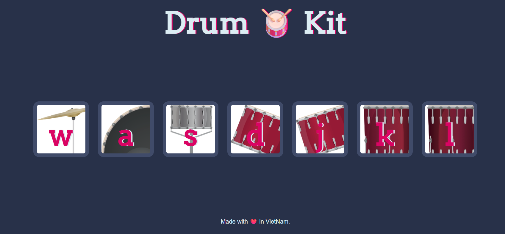

# 🥁 Virtual Drum Kit

A fun, interactive web-based drum kit built with **Vanilla JavaScript**. This project simulates a real drum set, allowing users to play sounds using their computer keyboard.

## 🛠 Technologies Used
*   **HTML5:** Structured the layout and mapped keyboard keys to drum elements.
*   **CSS3:** Styled the interface, added background images, and created key press animation effects (transform/transition).
*   **Vanilla JavaScript (ES6):** Handled logic for keydown events, audio playback, and DOM manipulation.

## ✨ Key Features
*   **Keyboard Interaction:** Play sounds by pressing specific keys:
    *   `W`: Snare
    *   `A`: Kick
    *   `S`: Crash
    *   `D`: Tom1
    *   `J`: Tom2
    *   `K`: Tom3
    *   `L`: Tom4
## 📚 What I Learned
As a Software Engineering student specialising in Java, this project helped me sharpen my frontend skills:
1.  **DOM Events:** Using addEventListener("click") and addEventListener("keydown").
2.  **Audio Handling:** Playing sounds instantly with new Audio().play() and Mapping different keys to different audio files.
3.  **CSS & JS Integration:** Adding/removing CSS classes (classList.add, classList.remove) and creating a quick animation effect using setTimeout()

---
Made with ❤️ by [QH]
